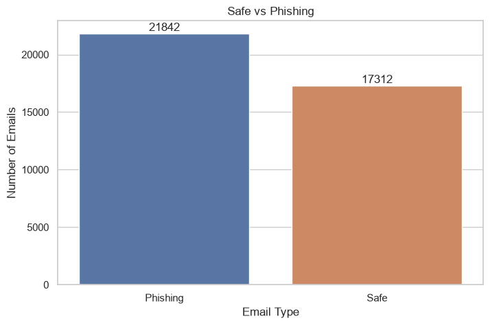
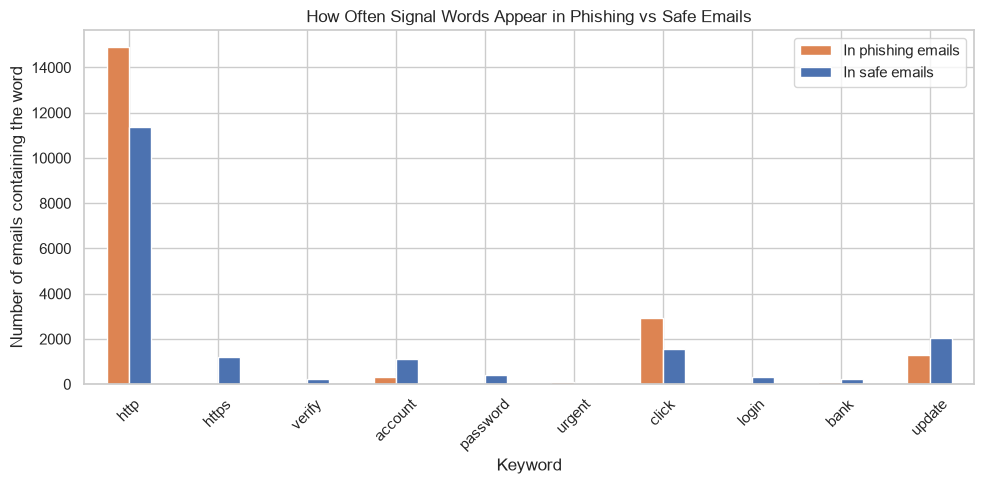
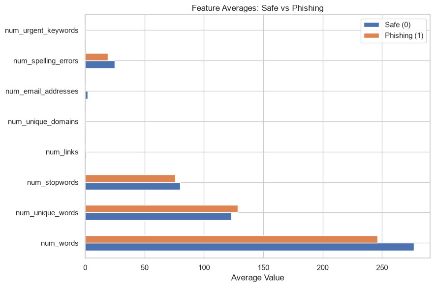
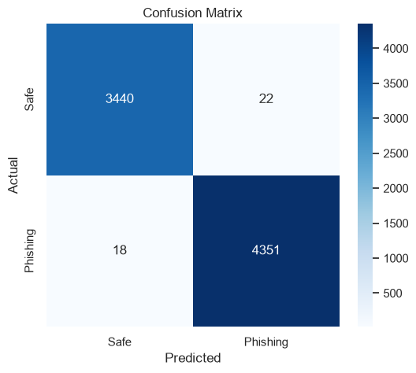
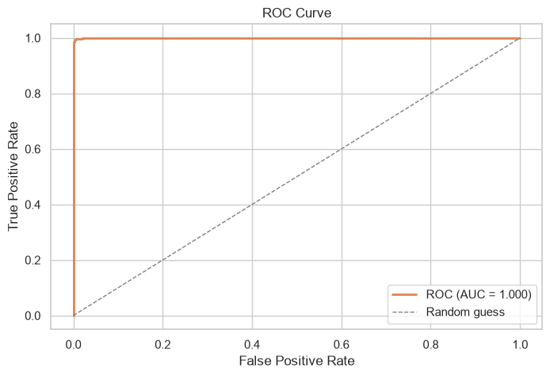

# Email Phishing Detection

An **educational** machine learning project that demonstrates, step by step, how
phishing emails can be detected from their text using a classic
**TF-IDF + Logistic Regression** pipeline.

> This is a learning project built for a university presentation. It is meant to
> teach the machine learning workflow — **not** a production-ready email security
> filter.

The full walkthrough is available in two languages:

| Notebook                  | Language |
| ------------------------- | -------- |
| [`eng.ipynb`](eng.ipynb) | English  |
| [`tr.ipynb`](tr.ipynb)   | Turkish  |

---

## Table of Contents

- [What Is Phishing?](#-what-is-phishing)
- [Datasets](#-datasets)
- [Project Structure](#-project-structure)
- [Machine Learning Workflow](#-machine-learning-workflow)
- [Exploratory Data Analysis](#-exploratory-data-analysis)
- [Feature Engineering](#-feature-engineering)
- [Results](#-results)
- [Installation](#-installation)
- [Usage](#-usage)
- [License](#-license)

---


## What Is Phishing?

- **Spam** is unsolicited bulk email, usually promotional and mostly harmless.
- **Phishing** is fraudulent email designed to *trick* the recipient into revealing
  sensitive information (passwords, banking details) by impersonating a trusted
  organization.

|                  | Spam         | Phishing                             |
| ---------------- | ------------ | ------------------------------------ |
| **Goal**   | Advertising  | Stealing information / fraud         |
| **Danger** | Usually low  | **High**                       |
| **Method** | Bulk sending | Impersonation + urgency + fake links |

Machine learning helps because phishing emails repeatedly rely on the same signals —
urgency ("verify now", "account suspended"), suspicious links, and requests for
credentials — which a model can learn from thousands of examples.

---

## Datasets

Two public Kaggle datasets are used, loaded automatically through
[`kagglehub`](https://github.com/Kaggle/kagglehub):

### 1. Main dataset — raw email text

- **Source:** [`naserabdullahalam/phishing-email-dataset`](https://www.kaggle.com/datasets/naserabdullahalam/phishing-email-dataset) (file: `CEAS_08.csv`)
- **Rows:** ~39,000 emails
- **Key columns:** `subject`, `body`, `label` (`1 = phishing`, `0 = safe`)
- Used to train the **main** model.

### 2. Comparison dataset — numerical features

- **Source:** [`ethancratchley/email-phishing-dataset`](https://www.kaggle.com/datasets/ethancratchley/email-phishing-dataset)
- **Rows:** ~525,000 emails
- Contains **8 pre-extracted numerical features** (word count, link count,
  urgent-keyword count, spelling-error count, ...) — **no raw text**.
- Used only for a **feature-engineering comparison** at the end.

> Because the second dataset has no raw text, text-based steps such as tokenization
> and TF-IDF cannot be applied to it. Comparing the two representations is itself one
> of the lessons of this project.

---

## Project Structure

```text
email-phishing-detection/
│
├── eng.ipynb            # Full walkthrough (English)
├── tr.ipynb             # Full walkthrough (Turkish)
├── README.md
├── requirements.txt
├── LICENSE
├── .gitignore
└── images/              # Figures used in this README
    ├── class_distribution.png
    ├── signal_words.png
    ├── confusion_matrix.png
    ├── roc_curve.png
    └── feature_averages.png
```

---

## Machine Learning Workflow

The notebook follows a clean, linear pipeline:

```text
Raw email text
      │
      ▼
Cleaning  (lowercase → remove links → remove punctuation → collapse whitespace)
      │
      ▼
TF-IDF vectorization  (tokenization + stop-word removal + weighting)
      │
      ▼
Train / Test split  (80% / 20%, stratified, fixed random seed)
      │
      ▼
Logistic Regression
      │
      ▼
Evaluation  (accuracy, precision, recall, F1, confusion matrix, ROC)
      │
      ▼
Live prediction on your own email
```

---

## Exploratory Data Analysis

Before modeling, the data is explored: class balance, missing values, and email
length distributions.



The main dataset is fairly balanced (~56% phishing), which means accuracy is a
reasonable — though not sufficient — metric on its own.

We also check which "signal words" (e.g. *verify*, *account*, *click*, *update*)
appear more often in phishing emails:



---

## Feature Engineering

Two different ways of representing an email are compared:

1. **Text → TF-IDF** (main model): the email text is converted into thousands of
   weighted word/bigram features. *TF-IDF* gives higher weight to words that are
   distinctive to a specific email and lower weight to words that appear everywhere.
2. **8 hand-crafted numerical features** (comparison model): each email is reduced to
   a small set of counts.



The comparison shows that the raw text carries far more signal than a handful of
summary numbers — a practical illustration of *why the representation of the data
matters as much as the model.*

## Results

On the held-out **20% test set** of the text dataset (`CEAS_08`):

| Model                                         | Accuracy | Precision | Recall |    F1 Score    |
| --------------------------------------------- | :------: | :-------: | :----: | :------------: |
| **TF-IDF + Logistic Regression** (main) |   0.99   |   0.99   |  1.00  | **0.99** |
| 8 numerical features (balanced comparison)    |   0.65   |   0.62   |  0.76  |      0.68      |

<p align="center">
  
  
</p>

> These scores reflect performance **on this specific dataset**. Real-world phishing
> is more varied and adversarial, so results on live email traffic would be lower.
> This project does not claim production readiness.

---

## Installation

```bash
# 1. Clone the repository
git clone https://github.com/gorkemergune/email-phishing-detection.git
cd email-phishing-detection

# 2. Create and activate a virtual environment
python3 -m venv .venv
source .venv/bin/activate        # Windows: .venv\Scripts\activate

# 3. Install dependencies
pip install -r requirements.txt
```

> The datasets are downloaded automatically by `kagglehub` the first time you run the
> notebook, so no manual download is required.

---

## Usage

```bash
jupyter notebook eng.ipynb   # English version
# or
jupyter notebook tr.ipynb    # Turkish version
```

Run the cells from top to bottom. At the end of the notebook you can paste **your own
email text** into the `email` variable and let the model classify it live:

```python
email = """
Dear Customer,
We detected unusual activity on your account. Please verify your account
immediately to avoid suspension. Click the link below...
"""

phishing_mi(email)
# → Prediction: Phishing | Probability (phishing): %70
```

---

## License

This project is licensed under the **MIT License** — see the [LICENSE](LICENSE) file
for details.

---

*Educational project — built to teach the machine learning workflow for phishing
email detection.*
